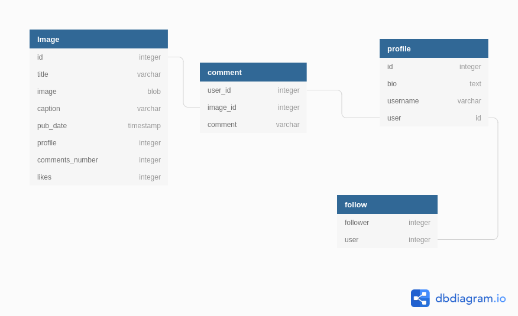

# Application Name
INSTAGRAM CLONE

[](https://opensource.org/licenses/MIT)
[](https://codebeat.co/projects/github-com-marknesh-instagram-app-master)

## DB Diagram



## Description
This application is basically a clone for the popular worldwide app known as instagram.
The user must first sign in inorder to use the application.After signing in the user can see the photos of the people he or she has followed.
THe user can also see his or her profile.


## Technologies used

Django 3.0.3.
Bootstrap
Python
Postgresql

# INSTALLATION

## Clone
```

git clone https://github.com/marknesh/instagram-app.git

```

## Create a virtual environment
```
python3.6 -m --without-pip virtual

```
## Run migration
```
python3.6 manage.py makemigrtaions
python3.6 manage.py migrate

```
## Run server
```
python3.6 manage.py runserver

```
## Run test
```
python3.6 manage.py test
```

## Troubleshooting
If you encounter any problems please feel free to contact me using the contacts provided  below incase you encounter any bugs.

## Support and contact details
Contact us on : 072432432
Email us on: neshinstagram@gmail.com

## Author
[marknesh]
